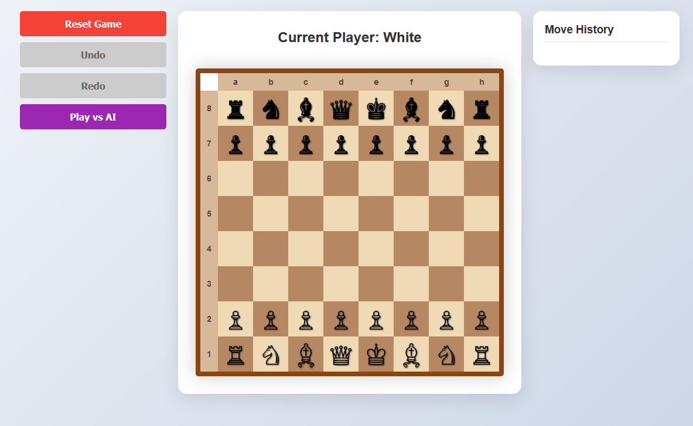

# Chess Game

This is a simple chess game created experimentally with Cursor prompts.



## How to Start

1. Clone the repository using the command:

   ```
   git clone https://github.com/AndrisKeiss/chess-game.git
   ```

2. Navigate to the project directory:

   ```
   cd chess-game
   ```

3. Install the necessary dependencies:

   ```
   npm install
   ```

4. Start the game locally:

   ```
   npm start
   ```

Enjoy the game!